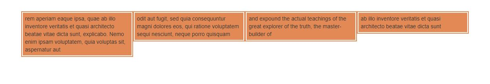
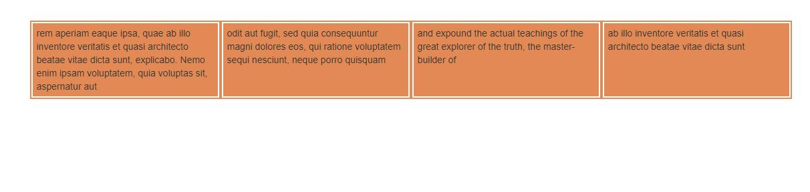

Sameify jQuery Plugin
=====================
---------------------
Makes selected elements at least the height of the tallest element in the group
-------------------------------------------------------------------------------
Helps to make items with different amounts of text look uniform even when lines wrap causing some elements to have more lines, thus making them taller.   
   
Before Sameify:

----------

After Sameify:

----------
   
Incorporates debounce so that it doesn't fire a million times if the browser is resized.   
   
Usage:   
Import script - `<script type="text/javascript" src="./jquery.sameify.min.js"></script>`   
Sameify your elements - `$('.shared-class').sameify();`    
    
Options:   
*  refresh: 200 - debounce time in ms that the plugin will wait while the window is being resized   
*  min: 0 - minimum width in pixels for the plugin to work (useful if items collapse, making same height irrelevant)   
*  max: 6000 - maximum width in pixels for the plugin to work (useful if items become uniform at a certain width and calculation is no longer needed)   
    
Example: 
```javascript    
$('.shared-class').sameify({   
  refresh: 50,   
  min: 767,   
  max: 1440   
});
```   
